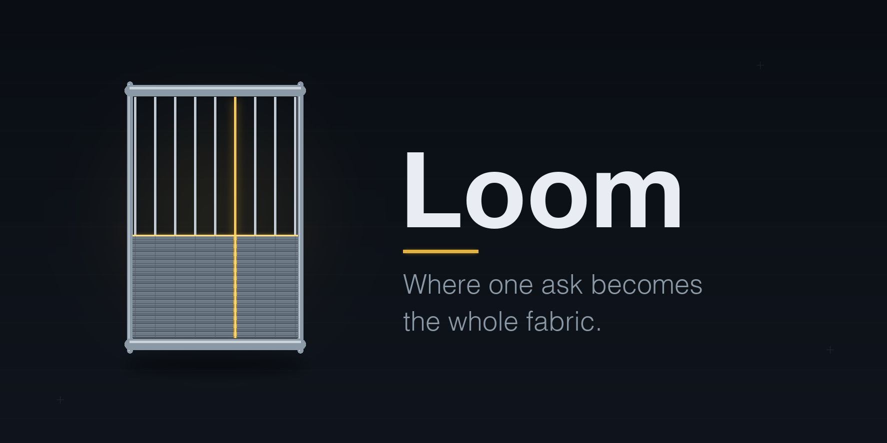

<div align="center">



# 🧵 Loom

### Where one ask becomes the whole fabric. Part of the Forge suite.

[](LICENSE)
[](https://github.com/mhd-nasher)
[](#)
[](FORGE_DNA.md)
[](FORGE_DNA.md)
[](#contributing)
[](https://github.com/mhd-nasher/loom)

**Created by [Mohammed Nasher](https://github.com/mhd-nasher) · Open source (MIT) · Free for anyone to use**

</div>

---

Loom is a self-contained **feature-completeness engine** for AI coding assistants. You hand it a vague
feature ask — *"add a booking feature"*, *«أبي ميزة حجز»* — and it returns the whole fabric: every actor,
every user flow with every exit, every screen state, every data-lifecycle moment, every race, every money
rule, down to Given/When/Then acceptance criteria. And you can point it the other way: at a feature you
**already built**, to find what you missed before production finds it for you.

A loom holds many threads under tension and weaves them into one continuous fabric — and the weaver sees
every thread, because a single dropped thread is a hole in the finished cloth. Loom does that for
features: people spec the thread they can see (the feature's essence) and ship holes where the forgotten
details were. Loom's job is that **nothing is skipped silently** — every detail is either specified or
cut aloud with a reason.

> **Who built this?** Loom is designed and authored by **Mohammed Nasher**
> ([@mhd-nasher](https://github.com/mhd-nasher)). Released open source under MIT — use it, fork it, ship
> with it. If it helps you, a ⭐ and a mention go a long way.

## Why Loom is different

Most spec/requirements tooling fails in one of two ways: it **misses the details that burn** (the
double-charge on a double-tap, the delete with no cascade story, the payment failure with no way out), or
it **buries a small feature under enterprise ceremony** (demanding i18n plans and analytics funnels from
a weekend tool). Loom refuses both:

1. **The One-Weave Law.** One feature per run, woven whole: every dimension the stack profile applies is
   either specified or **explicitly cut with a stated reason** — a silent gap is a hole users fall
   through. Anything discovered outside the feature's goal is parked and routed, never explored inline.
   And the moment the weave is done, Loom **declares done and stops** — no "while we're at it", no
   selling the next task.
2. **It routes, it doesn't adjudicate.** Loom owns the feature's **definition only**. A structural
   question → **Cairn** (`R-`). A test need → **Anvil** (`T-`). A quality smell → **Lens** (`Q-`). A
   vulnerability → **Bastion** (`B-`). A deploy concern → **Relay** (`D-`). When a routed finding blocks
   the weave, Loom dispatches it as a **sealed subagent mission** with a strict return contract — the
   child solves only the named problem and ends with the seal line, then Loom resumes.
3. **Defined ≠ correct ≠ safe.** A complete spec is what Cairn structures, Anvil proves, and Bastion
   guards — Loom says so plainly and never claims a specced feature is a working or secure one.
4. **It's stack-aware — including systems.** Websites, mobile apps, **and APIs/backends**: on a headless
   service the consumer is the user, flows are call sequences, and the contract range (`F-150…F-158`)
   replaces the UI ranges — suppressions stated aloud, per profile.
5. **It's an advisor, not an autopilot.** Money, auth, access, deletion, and crypto decisions are
   **proposed with reasons and approved by the human** — a refund policy or a delete cascade is a
   business decision, never a default.
6. **It's verifiable.** Loom ships with evals that prove it activates correctly, *catches the classes of
   detail people forget*, and *does not invent requirements, wander lanes, or keep talking after done*.

## The two failure modes it's built to avoid

| Failure mode | What it looks like | How Loom avoids it |
|--------------|--------------------|--------------------|
| **The miss** | The feature ships its happy path; the double-booking race, the orphaned bookings, the declined-card dead end arrive in production. | The `F-###` catalogue swept per profile + evidence-first audits (Mode B) — every applied dimension specified or cut aloud. |
| **The invented requirement / the tangent** | An i18n plan demanded from a personal CLI; a mid-spec refactoring detour; "want me to also…?" after done. | The **One-Weave Law** + park-and-route (F-160/F-161) + declare-done-and-stop (F-162). |

## The modes

| Mode | For | What it does |
|------|-----|--------------|
| **Mode 0 — Guided Spec (Beginner)** | "I want this feature but I don't know what it needs." | Plain-language interview **in the user's own language** (Arabic first-class), one question at a time, progress gauges; ends with a complete spec. |
| **Mode A — Spec a New Feature** | A vague ask → a buildable spec. | Flow maps, dimension sweep with loud cuts, ⚠-marked money/delete decisions, acceptance criteria. |
| **Mode B — Audit a Built Feature** | "I built it — what did I miss?" | Reconstructs the implied spec from code, diffs it against the catalogue, delivers an evidence-cited gap report (P0–P3, CONFIRMED/LIKELY/HYPOTHESIS). |
| **Mode C — Map User Flows** | Just the flow map. | Happy spine + every exit + the guarded commit point; offers the full-spec upgrade once, then stops. |

Every run starts at **Step 0**: detect the stack and load the feature profile, read Cairn's structure and
complexity budget if present, scope the ONE feature, and gauge the user's level.

## Metadata

- **Version:** 1.0.0
- **Name:** `loom`
- **Author:** Mohammed Nasher ([@mhd-nasher](https://github.com/mhd-nasher))
- **Tagline:** where one ask becomes the whole fabric
- **Modes:** Guided (beginner) · Spec a New Feature · Audit a Built Feature · Map User Flows
- **Owns:** the feature's complete definition — actors, flows, states, edge cases, data lifecycle, acceptance criteria
- **Routes:** structure → Cairn · tests → Anvil · quality → Lens · security severity → Bastion · rollout → Relay
- **Stack-aware:** Firebase/Flutter/Next/Stripe flagship · web · mobile · backend/API/system · internal tool/CLI
- **Citable:** every dimension maps to a stable `F-###` id
- **Category:** Feature definition, specification & completeness auditing
- **Risk:** Low (advisory — defines and audits; money/auth/deletion decisions proposed, human approves; writes no code)
- **License:** MIT

## What's inside

```
loom/
├── SKILL.md          # Entry point: identity, Honesty Contract, Step 0, modes, core checks, the One-Weave Law
├── README.md
├── FORGE_DNA.md      # The shared suite contract + boundary table (read first)
├── LICENSE  CHANGELOG.md  CITATION.cff  CONTRIBUTING.md  .gitignore
├── reference/        # checks.md (the F-### catalogue) + plain-language mirror + stack-feature-profiles.md
│                     #   + flow-mapping.md + state-and-lifecycle.md + edge-case-hunting.md
│                     #   + acceptance-criteria.md + handoff-protocol.md + glossary.md
├── workflows/        # guided-spec-for-beginners.md (Mode 0) + spec-new-feature.md (A)
│                     #   + audit-built-feature.md (B) + map-user-flows.md (C)
├── checklists/       # feature-completeness-review.md (deep) + pre-build-gate.md (the F-GATE gate)
├── templates/        # feature-spec-template.md · gap-report.md · handoff-brief.md
├── examples/         # booking-feature-from-vague-ask.md (flagship) · audit-existing-payout-screen.md
│                     #   · api-webhook-endpoint-contract.md (the systems half)
├── scripts/          # spec_lint.py (silent-gap finder; leads, not verdicts; self-tested)
├── evals/            # trigger-eval.json + evals.json + README.md (skill-TDD)
└── assets/           # brand assets + generation prompts (matched to the sibling set)
```

## Install

**Claude Code (recommended):**

```bash
git clone https://github.com/mhd-nasher/loom.git ~/.claude/skills/loom
```

Then start a new session. Loom auto-activates when you discuss speccing a feature, mapping user flows,
finding forgotten details, or auditing a built feature — in English or Arabic.

**Any other AI assistant:** open `SKILL.md` and paste its content (plus the files it references as
needed) into your assistant's context, or attach the repo as a knowledge source.

## How to use it

Say what you want, naturally:

- *"Spec this booking feature properly — what am I forgetting?"*
- *"Map the full user flow for checkout."*
- *"I built the delete-account feature — did I miss anything?"* → Mode B, the gap report
- *"Define the contract for our partner webhook."* → the systems profile
- *«أبي ميزة حجز بس ما أعرف وش تحتاج»* → Mode 0, guided, in Arabic

Loom weaves one feature per run — and when the fabric is done, it stops.

## Verify it works

From the repo root:

```bash
python3 scripts/spec_lint.py --self-test
```

```bash
cd evals && python3 -c "import json; json.load(open('trigger-eval.json')); json.load(open('evals.json')); print('evals OK')"
```

```bash
python3 scripts/spec_lint.py templates/feature-spec-template.md
```

The first proves the linter catches every gap class (8/8). The second validates the eval files. The
third runs the linter against the intentionally-unfilled template — expect leads: that's the tool
refusing a silent gap, which is the whole point.

## Scope & honesty

Loom produces a complete **definition**, not a guarantee. A fully-specified feature can still be built
wrong (Anvil proves behavior), built unsafely (Bastion owns severity), or structured badly (Cairn owns
design). Mode B's gap report cites evidence for every CONFIRMED claim and labels the rest LIKELY or
HYPOTHESIS — and fixing anything remains a human decision. Money, auth, access, deletion, and crypto
choices are proposed, never silently made.

## The Forge suite & the boundary contract

| Skill | Owns | Loom's relationship |
|-------|------|---------------------|
| 🧵 **Loom** | Feature definition & completeness | This repo. |
| 🧭 [Helm](https://github.com/mhd-nasher/helm) | The product loop — bets, priorities, verdicts | Helm's winning bet is Loom's ask; Loom's instrumentation (F-120s) makes Helm's metric measurable. |
| 💎 [Facet](https://github.com/mhd-nasher/facet) | The interface | Loom says *which* states a screen must have (F-030s); Facet designs how they look and feel (`S-###`). |
| 🗿 [Cairn](https://github.com/mhd-nasher/cairn) | Architecture & structure | Loom's spec is Cairn's input; structure questions route to Cairn (`R-###`). |
| 🔨 [Anvil](https://github.com/mhd-nasher/anvil) | Testing | Loom's acceptance criteria are Anvil's starting line (`T-002`); Loom never writes a test. |
| 🔍 [Lens](https://github.com/mhd-nasher/lens) | Code quality & review | Quality smells noticed mid-weave park to Lens (`Q-###`). |
| 🛡️ [Bastion](https://github.com/mhd-nasher/bastion) | Security & resilience | Loom enumerates the abuse surface; Bastion owns severity and verdicts (`B-###`). |
| 🚀 [Relay](https://github.com/mhd-nasher/relay) | Ship & operate | Loom defines what rollout must handle; Relay owns the mechanics (`D-###`). |

The natural flow: **Helm sets the course → Loom defines → Facet gives it a face → Cairn designs → Anvil
tests → Lens cleans → Bastion guards → Relay ships → Helm reads the results — and the loop turns.**
Non-linear by design — enter at any skill, or invoke **`forge`** and let the conductor run the chain.

## Contributing

Contributions welcome — new stack profiles, sharper One-Weave guardrails, more evals (especially
`must_not` cases), new checks with their evals, worked examples, and plain-language/translation
improvements. See [CONTRIBUTING.md](CONTRIBUTING.md). A check without an eval doesn't ship.

## Author & Credits

**Mohammed Nasher** ([@mhd-nasher](https://github.com/mhd-nasher)) — design, authorship, and the Forge
suite. If Loom saved you from a production burn, a ⭐ helps others find it.

## License

[MIT](LICENSE) — free for anyone to use, fork, and build on.
